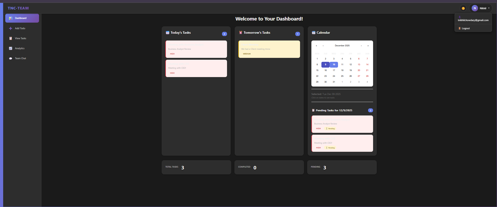
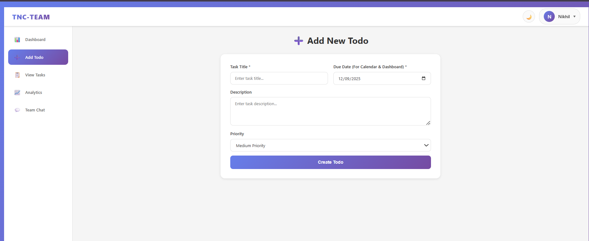
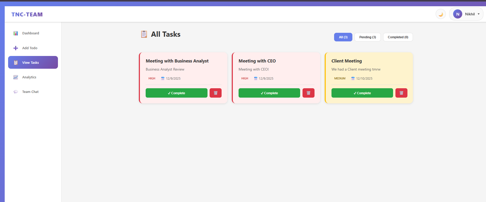
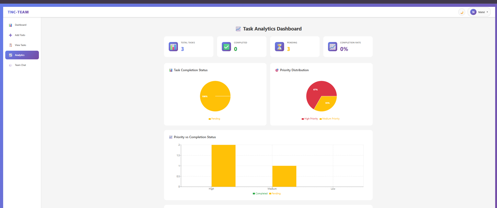

# 🚀 MERN Stack Todo Application with Team Chat

A full-stack task management application built with MongoDB, Express, React, and Node.js. Features include real-time team collaboration, analytics dashboard, user authentication, and a beautiful responsive UI with dark/light theme support.


---

## 📸 Application Screenshots

### 🎨 Dashboard Views

#### Light Theme Dashboard


*Clean, modern dashboard with Today's Tasks, Tomorrow's Tasks, and Calendar widget*

#### Dark Theme Dashboard


*Professional dark mode interface with purple/blue gradient accents*

---

### ✏️ Add Todo Feature



*Intuitive form for creating new tasks with priority levels and due dates*

**Features:**
- Task title input (required)
- Due date picker with calendar icon
- Description textarea
- Priority dropdown (High/Medium/Low)
- Clean, user-friendly form design

---

### 📋 View Tasks Page



*Comprehensive task management with filtering and actions*

**Features:**
- Filter by All, Pending, or Completed tasks
- Color-coded priority indicators
- Task cards with due dates
- Complete and Delete actions
- Visual priority borders (red for High, yellow for Medium)

**Sample Tasks Shown:**
- Meeting with Business Analyst (HIGH priority)
- Meeting with CEO (HIGH priority)
- Client Meeting (MEDIUM priority)

---

### 📊 Analytics Dashboard



*Data-driven insights with interactive charts and statistics*

**Features:**
- **Key Metrics Cards:**
  - Total Tasks count
  - Completed tasks
  - Pending tasks
  - Completion rate percentage

- **Visual Charts:**
  - Task Completion Status (Pie Chart)
  - Priority Distribution (Pie Chart)
  - Priority vs Completion Status (Bar Chart)

---

### 💬 Team Chat


*Real-time collaboration with instant messaging*

> **Note:** Team Chat screenshot coming soon!

**Features:**
- Real-time messaging with Socket.io
- Online status indicator
- User identification and timestamps
- Message input with send button
- Attachment support
- Clean, interactive chat interface

---

## ✨ Key Features

### 🔐 Authentication & Security
- User registration and login
- JWT-based authentication
- Protected routes
- Password encryption with bcrypt

### 📝 Task Management
- Create, read, update, and delete todos
- Priority levels (High, Medium, Low)
- Due date tracking
- Task completion status
- Calendar integration

### 📊 Analytics & Insights
- Real-time statistics dashboard
- Task completion metrics
- Priority distribution charts
- Visual data representation

### 💬 Real-Time Collaboration
- Team chat functionality
- Socket.io integration
- Online status indicators
- Message history

### 🎨 User Experience
- Dark/Light theme toggle
- Responsive design (mobile-friendly)
- Modern, clean UI
- Intuitive navigation
- Smooth animations

### 👥 Admin Features
- Admin dashboard
- User management
- System statistics
- Advanced controls

---

## 🛠️ Tech Stack

### Frontend
- **React** 19.2.0 - UI framework
- **React Router** - Navigation
- **Axios** - HTTP client
- **Socket.io Client** - Real-time communication
- **Recharts** - Data visualization
- **React Calendar** - Date picker

### Backend
- **Node.js** - Runtime environment
- **Express.js** - Web framework
- **MongoDB** - Database (MongoDB Atlas)
- **Mongoose** - ODM
- **Socket.io** - WebSocket server
- **JWT** - Authentication
- **bcryptjs** - Password hashing

### Deployment
- **Railway** - Backend hosting
- **Vercel** - Frontend hosting
- **MongoDB Atlas** - Cloud database

---

## 🚀 Quick Start

### Prerequisites
- Node.js (v18 or higher)
- npm or yarn
- MongoDB Atlas account (or local MongoDB)

### Installation

1. **Clone the repository**
```bash
git clone https://github.com/tnikhilchowdary/fullstack-project-using-AI.git
cd fullstack-project-using-AI
```

2. **Install Backend Dependencies**
```bash
cd backend
npm install
```

3. **Install Frontend Dependencies**
```bash
cd ../frontend
npm install
```

4. **Configure Environment Variables**

**Backend (`backend/.env`):**
```env
MONGODB_URI=your_mongodb_connection_string
JWT_SECRET=your_jwt_secret_key
PORT=5000
NODE_ENV=development
FRONTEND_URL=http://localhost:3000
```

**Frontend (`frontend/.env`):**
```env
REACT_APP_API_URL=http://localhost:5000
```

5. **Start Backend Server**
```bash
cd backend
npm start
```

6. **Start Frontend Server**
```bash
cd frontend
npm start
```

7. **Access the Application**
- Frontend: http://localhost:3000
- Backend API: http://localhost:5000

---

## 📱 Application Structure

```
project-app-assignment/
├── backend/                 # Backend server
│   ├── controllers/        # Business logic
│   ├── models/             # Database models
│   ├── routes/             # API routes
│   ├── middleware/         # Auth middleware
│   └── server.js            # Express server
├── frontend/               # React application
│   ├── src/
│   │   ├── components/     # React components
│   │   ├── pages/          # Page components
│   │   ├── context/        # Context providers
│   │   ├── services/       # API services
│   │   └── styles/         # CSS files
│   └── public/             # Static files
└── screenshots/            # Application screenshots
```

---

## 🎯 API Endpoints

### Authentication
- `POST /api/auth/register` - Register new user
- `POST /api/auth/login` - Login user
- `GET /api/auth/profile` - Get user profile (Protected)

### Todos
- `GET /api/todos` - Get all todos (Protected)
- `GET /api/todos/:id` - Get single todo (Protected)
- `POST /api/todos` - Create new todo (Protected)
- `PUT /api/todos/:id` - Update todo (Protected)
- `DELETE /api/todos/:id` - Delete todo (Protected)

### Chat
- `GET /api/chat/messages` - Get chat messages (Protected)
- WebSocket: Real-time messaging via Socket.io

### Admin
- `GET /api/admin/stats` - Get admin statistics (Admin only)
- `GET /api/admin/users` - Get all users (Admin only)

---

## 🌐 Deployment

### Deploy to Railway + Vercel (Recommended - Easiest)

See detailed guides:
- **[EASIEST_DEPLOY.md](EASIEST_DEPLOY.md)** - Simple Railway + Vercel deployment
- **[DEPLOYMENT_STEP_BY_STEP.md](DEPLOYMENT_STEP_BY_STEP.md)** - Complete step-by-step guide

### Deploy to AWS

See AWS deployment guide:
- **[AWS_DEPLOYMENT_GUIDE.md](AWS_DEPLOYMENT_GUIDE.md)** - Complete AWS deployment
- **[AWS_QUICK_START.md](AWS_QUICK_START.md)** - Quick AWS reference

---

## 📸 Screenshots Gallery

All screenshots are available in the [`screenshots/`](screenshots/) folder.

**Documentation:**
- [Screenshots Log](screenshots/SCREENSHOTS_LOG.md) - Detailed log of all screenshots
- [Features Documented](screenshots/FEATURES_DOCUMENTED.md) - Feature tracking
- [Theme Comparison](screenshots/THEME_COMPARISON.md) - Light vs Dark theme

---

## 👤 Default Admin Credentials

For testing purposes:
- **Email:** `admin@gmail.com`
- **Password:** `Admin@1234`

⚠️ **Note:** Change these credentials in production!

---

## 🧪 Testing

### Postman Collection
Import the Postman collection from `backend/Todo-API.postman_collection.json` for API testing.

### Manual Testing
1. Register a new user
2. Login with credentials
3. Create a todo
4. View tasks
5. Check analytics
6. Test team chat
7. Toggle theme (dark/light)

---

## 📚 Documentation

- **[Authentication Guide](AUTHENTICATION_GUIDE.md)** - Auth setup and usage
- **[Frontend Guide](FRONTEND_GUIDE.md)** - Frontend development
- **[Backend API Guide](backend/POSTMAN_TESTING_GUIDE.md)** - API documentation
- **[Deployment Guides](DEPLOYMENT_STEP_BY_STEP.md)** - Deployment instructions

---

## 🤝 Contributing

Contributions are welcome! Please feel free to submit a Pull Request.

1. Fork the repository
2. Create your feature branch (`git checkout -b feature/AmazingFeature`)
3. Commit your changes (`git commit -m 'Add some AmazingFeature'`)
4. Push to the branch (`git push origin feature/AmazingFeature`)
5. Open a Pull Request

---

## 📄 License

This project is licensed under the MIT License.

---

## 👨‍💻 Author

**Nikhil Chowdary**
- GitHub: [@tnikhilchowdary](https://github.com/tnikhilchowdary)
- Project: [fullstack-project-using-AI](https://github.com/tnikhilchowdary/fullstack-project-using-AI)

---

## 🙏 Acknowledgments

- MongoDB Atlas for database hosting
- Railway for backend hosting
- Vercel for frontend hosting
- React community for amazing tools and libraries

---

## 📊 Project Statistics

- **Total Features:** 5+ main features
- **Screenshots:** 6+ documented
- **API Endpoints:** 15+
- **Tech Stack:** MERN (MongoDB, Express, React, Node.js)
- **Deployment:** Railway + Vercel / AWS

---

## ⭐ Show Your Support

If you like this project, please give it a ⭐ on GitHub!

---

**Made with ❤️ using MERN Stack**
